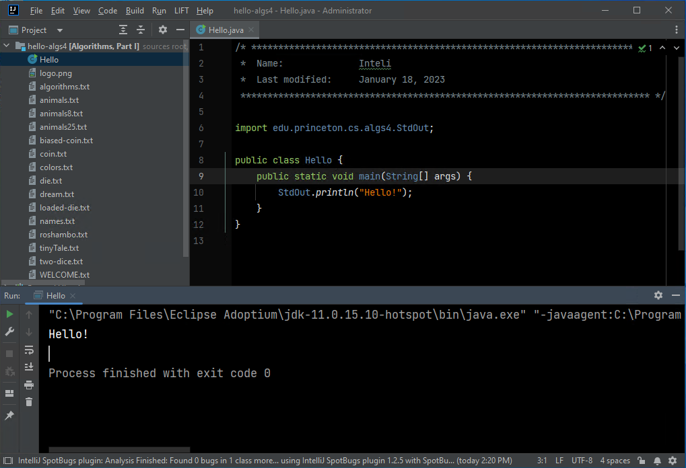
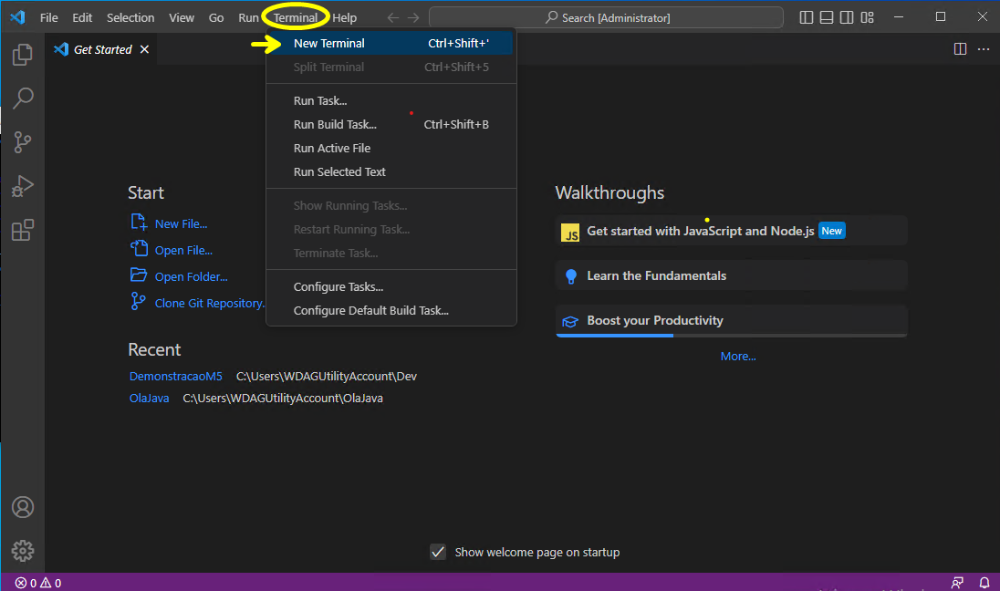
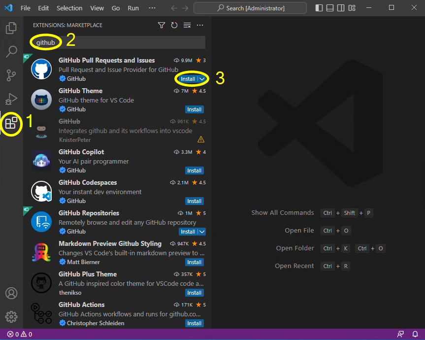
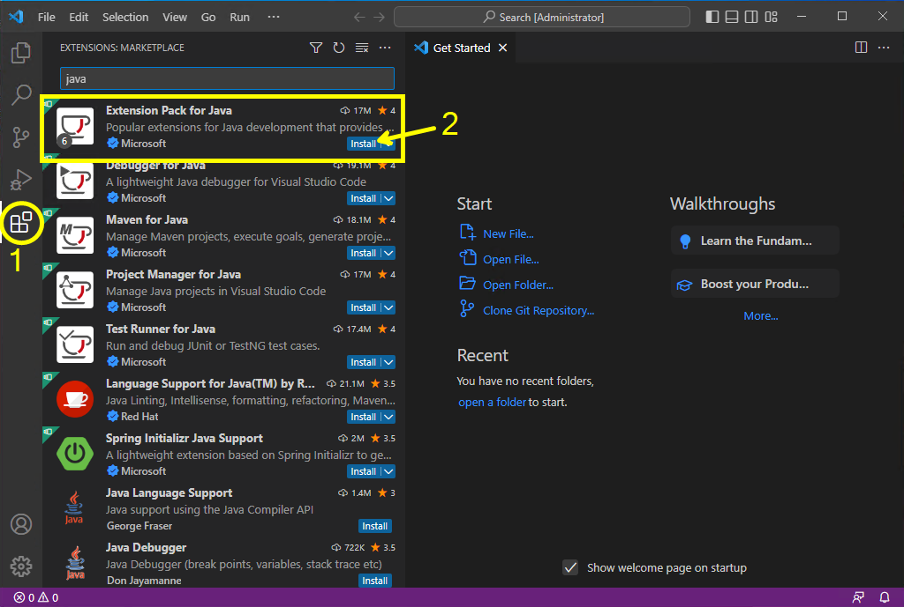
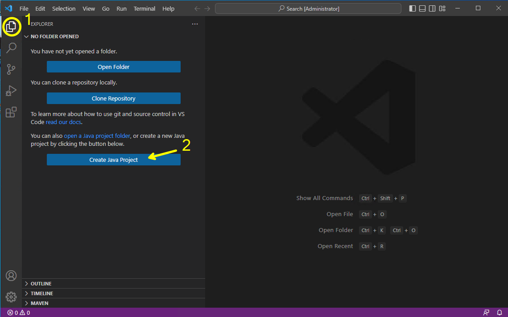
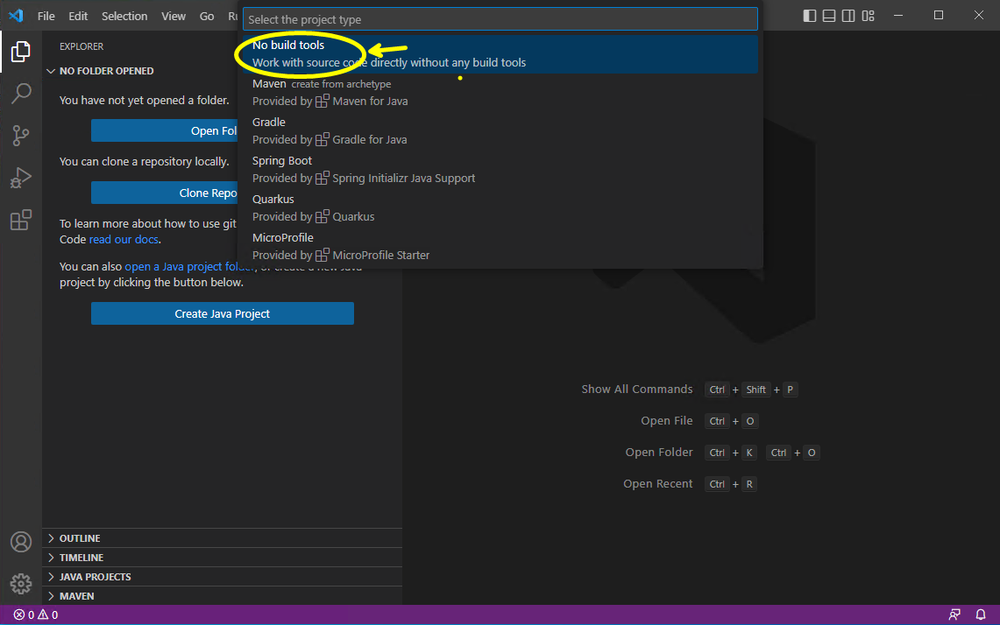
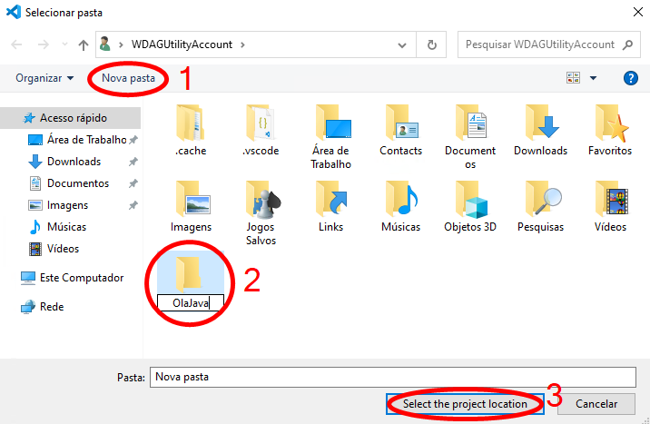
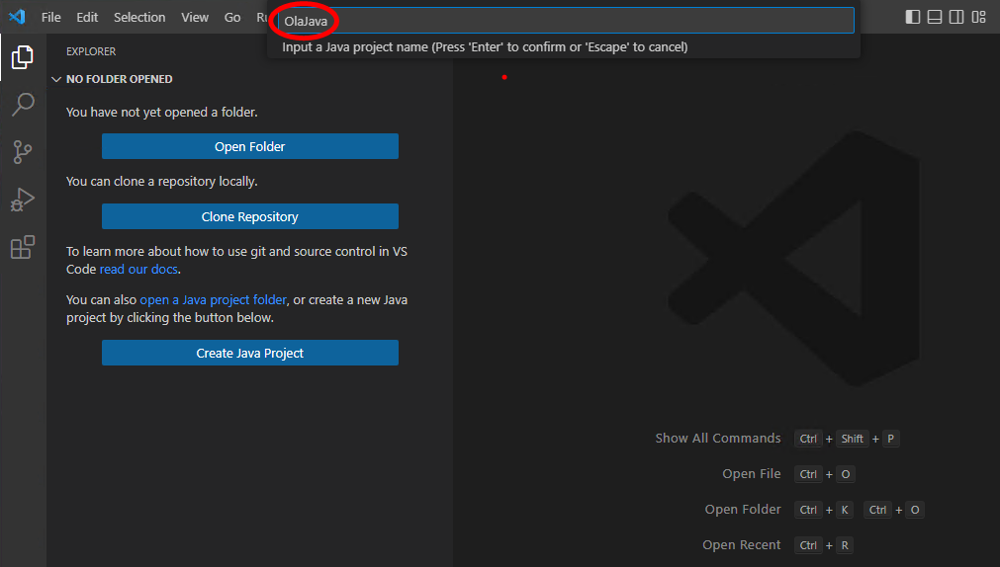
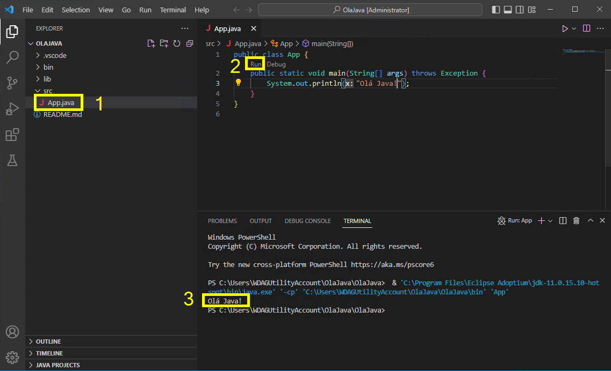
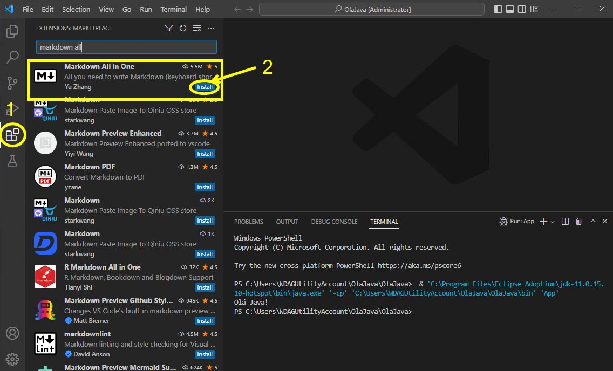

# Preparação do ambiente de trabalho no seu computador

Como no Inteli o Windows é o sistema operacional mais comumente utilizado, as instruções deste documente são específicas para computadores com este sistema. A instalação destas ferramentas em computadores com Linux ou MacOS é possível, mas provavelmente será necessário buscar procedimentos específicos para estes sistemas operacionais.

## Instalação do kit de desenvolvimento Java para as tarefas de programação

As tarefas de programação deste módulo 5 utilizarão o kit de desenvolvimento proposto pelo [LIFT-CS (*Laboratory for Innovation for the Future of Teaching Computer Science*)](https://lift.cs.princeton.edu) da Universidade de Princeton. Este pacote inclui o JDK 11, o Git e a IDE IntelliJ. Comece pela instalação deste pacote (mesmo que você pretenda utilizar outra IDE no desenvolvimento do projeto), pois o JDK 11 e o Git serão necessários.

Procedimento:

1. Acesse https://lift.cs.princeton.edu/java/windows/
2. Baixe o instalador indicado.
3. Faça a instalação do kit.
4. Siga o procedimento descrito na página para executar um primeiro programa no ambiente.

Este ambiente de desenvolvimento já vem configurado para facilitar o desenvolvimento os programas solicitados nas tarefas de programação dos nossos autoestudos.

## Instalação do Visual Studio Code

Embora o kit de desenvolvimento mencionado no item anterior seja o mais indicado para as tarefas de programação do nosso curso, para o desenvolvimento do projeto sugerimos utilizar o Visual Studio Code devido à sua facilidade de integração com o Git e devido ao grande número de extensões disponíveis (em particular, as extensões relacionadas ao formato Markdown).

Procedimento:

1. Acesse https://code.visualstudio.com/
2. Baixe o instalador indicado.
3. Faça a instalação do programa.
4. Execute o Visual studio Code.
   

   

## Configuração do Git

Se esta é a primeira vez que você utiliza o Git no seu computador, execute o procedimento a seguir para configurar o usuário e o email.

Procedimento:

1. No Visual Studio Code, abra um terminal.

2. Execute os comandos para configurar o seu nome e o seu email.

## Instalação da extensão *GitHub Pull Requests and Issues*

1. Execute o Visual Studio Code.
2. Acesse a área das extensões e instale a extensão *GitHub Pull Requests and Issues*.

## Instalação das extensões do Visual Studio Code para o desenvolvimento Java

Faça a instalação das extensões do Visual Studio Code para o desenvolvimento de aplicações na plataforma Java.

Procedimento:

1. Execute o Visual Studio Code.
2. Acesse a área das extensões e instale o *Extension Pack for Java*.

3. Para testar o ambiente de desenvolvimento, crie um novo projeto Java.

4. Para este primeiro teste, seleciona a opção *No build tools*.

5. Crie e selecione a pasta para o projeto.

6. Defina o nome do projeto.

7. Execute o programa-exemplo e verifique se a execução é bem-sucedida.

## Instalação das extensões do Visual Studio Code para a elaboração da documentação

A documentação do projeto utiliza o formato Markdown. Para tornar mais conveniente a edição de arquivos neste formato, vamos instalar no Visual Studio Code algumas extensões específicas para Markdown.

Procedimento:

1. Execute o Visual Studio Code.

2. Acesse a área das extensões e instale o *Markdown All in One*.

## Instalação das extensões do Visual Studio Code e das ferramentas para a elaboração do artigo

Neste módulo cada grupo deverá redigir um texto descrevendo os resultados do projeto no formato de um artigo científico. O conteúdo deste artigo será editado no formato Markdown, mas a geração do artigo em um formato próximo ao solicitado pelas publicações científicas será realizado utilizando as ferramentas LaTeX e pandoc.

Procedimento:

1. Acesse https://pandoc.org/installing.html e, a seguir, baixe e instale a ferramenta **pandoc**.

2. Acesse https://miktex.org/download e, a seguir, baixe e instale o sistema básico TeX/LaTeX.

3. Execute o Visual Studio code e, a seguir, acesse a área das extensões e instale o *vscode-pandoc* (instale a que tem como autor o *DougFinke*).

4. Ainda no Visual Studio Code, instale a extensão *vscode-pdf* (instale a que tem como autor o *tomoki1207*).

